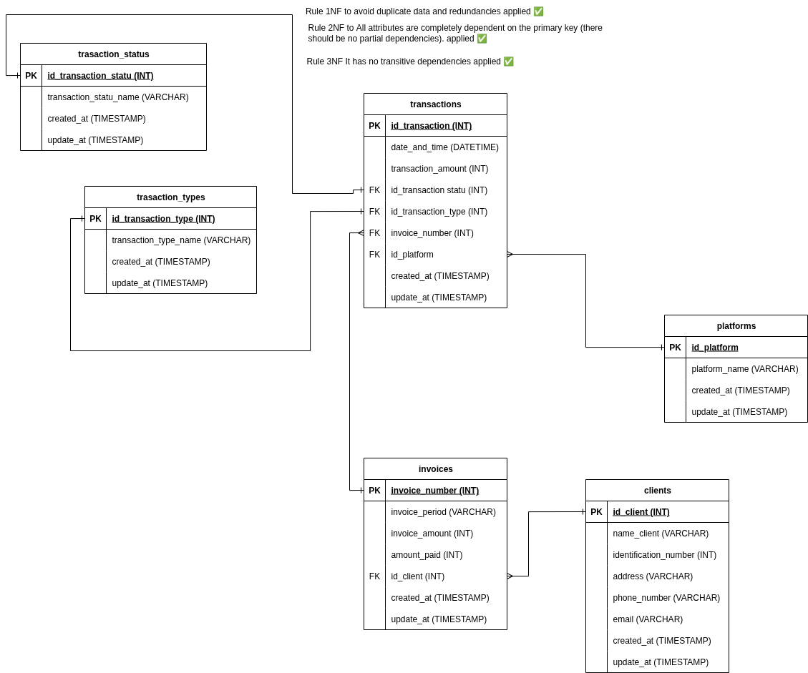

# 📚 EXPERSOFT

A solution that allows
this information to be organized and structured in a SQL database, facilitating its loading,
storage, and subsequent management through a CRUD system, along with
key queries that meet the client's needs.
---

## 📋 Instructions to Run the Project / Instrucciones para ejecutar el proyecto
1. *Clone the repository / Clonar el repositorio:*
   git clone  https://github.com/iquintero24/performance_test.git
   cd EXPERTSOFT

2. *Install dependencies / Instalar dependencias:*
   npm install

3. *Create and configure the .env file / Crear y configurar el archivo .env:*
   DB_HOST=localhost
   DB_USER=root
   DB_PASSWORD=password
   DB_NAME=db_name
   DB_PORT=3306

4. *Start the backend / Iniciar el backend:*
   node server/index.js

5. *Start the frontend / Iniciar el frontend:*
   npm run dev

---

## 📁 Estructura del proyecto
```bash
biblioteca/
│
├── docs/ # Documentation
│       ...
├── app/ # Frontend (HTML, CSS, JS)
│       ...
├── server/ # Backend
│       ...
├── index.html 
├── .env # Variables de entorno
├── .gitignore
└── README.md
```


## 🚀 Technologies Used / Tecnologías utilizadas
- Node.js  
- Express.js  
- MySQL  
- HTML, CSS, JavaScript (Frontend)  
- csv-parser (for loading data from CSV files / para cargar datos desde archivos CSV)  
- Vite  

---

## 📑 Normalization Explanation / Explicación de la normalización


## Normalization

1NF: Atomic data was verified so that columns and rows were not repeated.

2NF: Partial dependencies were separated into tables, for example: transaction_types or transaction_status.

3NF: Transitional dependencies were eliminated, for example, users were separated from transactions.

---

## 📂 Bulk Upload from CSV / Instrucciones para la carga masiva desde CSV
The system supports importing data from CSV files using the *csv-parser* library.  
El sistema soporta la importación de datos desde archivos CSV usando la librería *csv-parser*.  

*Steps / Pasos:*
1. Place the CSV file inside the designated server/data  
   Coloca el archivo CSV dentro de la carpeta server/data

2. Ensure the file follows the required column structure and create the seeder.js and export the function for run_seeders.js
   Asegúrate de que el archivo siga la estructura de columnas requerida y crea el archivo load.example.js y exporta la funcion a run_seeders.js

3. Run the import script (run_seeders) the functionality from the backend endpoint that processes the CSV.  
   Ejecuta el script de importación (run_seeders) o utiliza la funcionalidad desde el endpoint del backend que procesa el CSV.

---

## 🔍 Advanced Queries Explanation / Explicación de las consultas avanzadas

1. The first query brings the total paid by each client

---

---

## 👤 Developer Information / Datos del desarrollador
- *Name / Nombre:* Isaac David Quintero Lobo
- *Clan:* Cienaga
- *Email / Correo:* Isaacquintero4k@gmail.com

---
